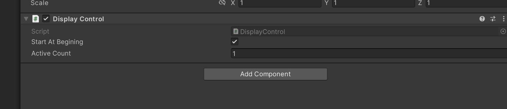
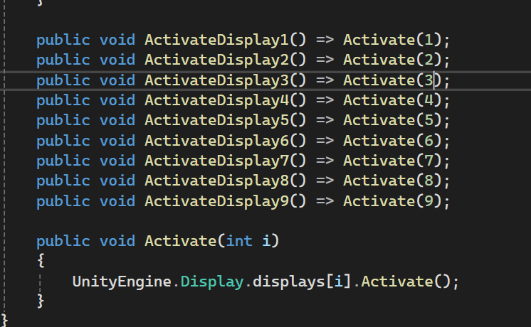

# Package Display

A simple display control component.

Here is how the component looks like.

* StartAtBegining - Activate display at Start functions
* ActiveCount - Activate how many index at begining

Provide functions to use
